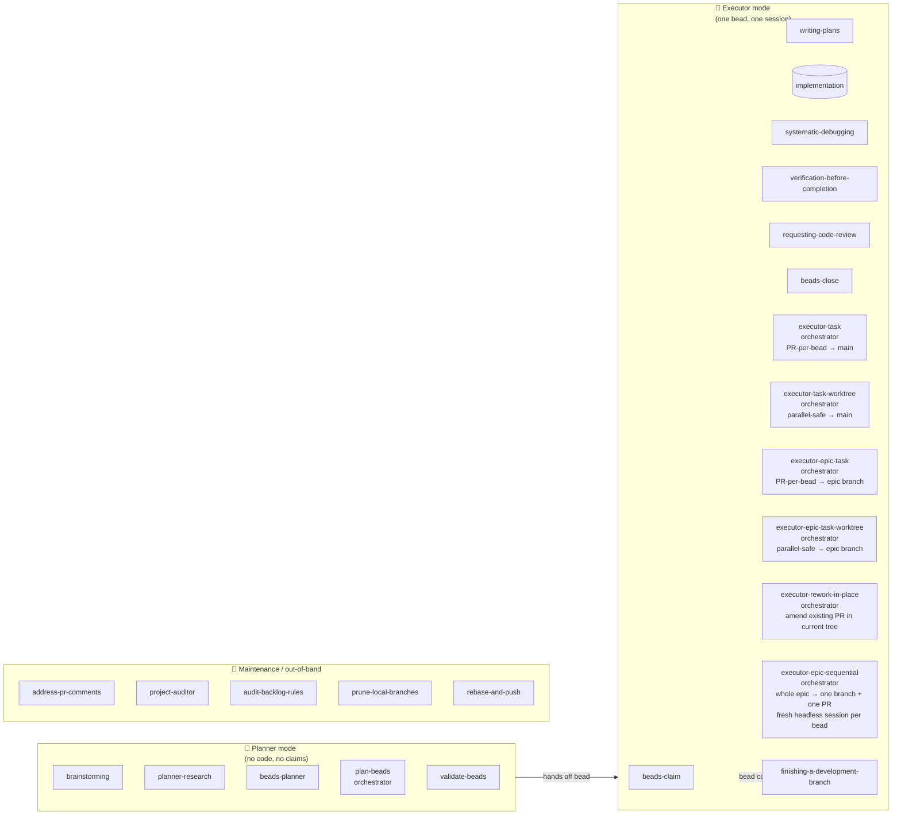
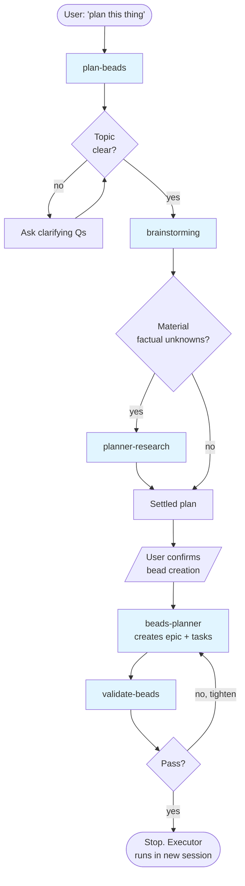
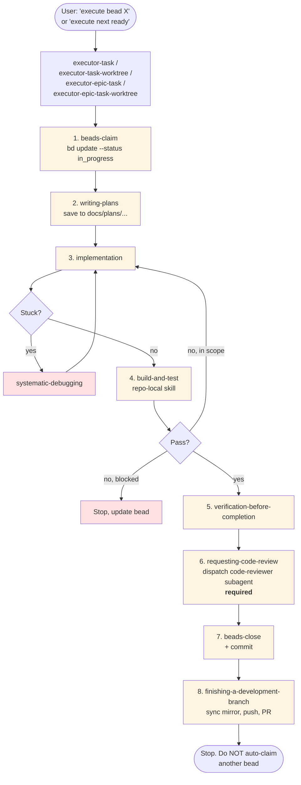
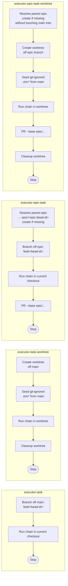

# Skills Relationships

A map of every skill under `skills/` — what each one does, who calls it, who it calls, and where it sits in the overall workflow. Read this before customizing or adding a skill so the new piece slots into an existing seam instead of creating a parallel one.

The canonical end-user description of the workflow lives in `templates/BEADS_WORKFLOW.md` (which is what gets shipped into downstream repos). This document is the _internal_ view: the skills as a graph.

---

## 1. The two execution modes

Every skill belongs to exactly one of two modes (plus maintenance ops that sit alongside). The mode boundary is what the `<HARD-GATE>` blocks in many SKILL.md files are protecting.

**Hard rule encoded in the diagram:** planner skills must NOT invoke executor skills. The bead-creation handoff is the _only_ legal exit from planner mode.

**Maintenance skills** are user-invoked at any point and don't belong to a phase: they sit alongside the workflow rather than inside it. They may dispatch internal subagents (see §5.5) but never claim, plan, or close beads.

---

## 2. Skill catalog (one-liner per skill)

| Skill                            | Mode                            | Role                                               | Invoked by                                                                | Invokes                                                                            |
| -------------------------------- | ------------------------------- | -------------------------------------------------- | ------------------------------------------------------------------------- | ---------------------------------------------------------------------------------- |
| `brainstorming`                  | planner                         | Turn fuzzy idea into a settled design              | `plan-beads`, user                                                        | `planner-research` (optional)                                                      |
| `planner-research`               | planner                         | Resolve factual unknowns before bead creation      | `brainstorming`, `plan-beads`                                             | —                                                                                  |
| `beads-planner`                  | planner                         | Translate settled plan into epic + tasks           | `plan-beads`                                                              | —                                                                                  |
| `plan-beads`                     | planner (orchestrator)          | Run a full planner session end-to-end              | user                                                                      | `brainstorming` → `planner-research` → `beads-planner` → `validate-beads`          |
| `validate-beads`                 | planner                         | Quality gate before execution                      | `plan-beads`, user                                                        | —                                                                                  |
| `beads-claim`                    | executor                        | Find + claim one ready bead                        | `executor-task` orchestrators, user                                       | —                                                                                  |
| `writing-plans`                  | executor                        | Write the implementation plan for the claimed bead | `executor-task` orchestrators, user                                       | `requesting-code-review` (for plan review during chunked drafting)                 |
| `systematic-debugging`           | executor                        | Root-cause investigation when blocked              | implementation step                                                       | —                                                                                  |
| `responsive-layout-testing`      | executor                        | Screenshot a page at 6 widths via Chrome DevTools MCP, fix overflow/layout breaks | implementation step, user                                  | `systematic-debugging`, `verification-before-completion` (defers completion claim) |
| `verification-before-completion` | executor                        | Evidence-before-claims gate                        | `executor-task` orchestrators                                             | —                                                                                  |
| `requesting-code-review`         | executor                        | Dispatch the local code-reviewer subagent (`.claude/agents/code-reviewer.md`, and `.codex/agents/code-reviewer.md` when Codex is enabled) | `executor-task` orchestrators (required, not optional)                    | —                                                                                  |
| `beads-close`                    | executor                        | Close bead + create follow-ups + commit            | `executor-task` orchestrators, user                                       | —                                                                                  |
| `executor-task`                  | executor (orchestrator)         | One bead delivered as its own PR off a fresh branch from main | user                                                                      | `beads-claim` → `writing-plans` → impl → `build-and-test` → verify → `beads-close` → `finishing-a-development-branch` |
| `executor-task-worktree`         | executor (orchestrator)         | Same as `executor-task`, but in an isolated git worktree (parallel-safe) | user                                                                      | same chain as `executor-task`                                                      |
| `executor-epic-task`             | executor (orchestrator)         | Same as `executor-task` but branches off (and PRs into) the bead's parent epic branch `epic/<epic-bead-id>` (bead id only, no slug); auto-creates the epic branch from the default branch if missing | user                                                                      | same chain as `executor-task`                                                      |
| `executor-epic-task-worktree`    | executor (orchestrator)         | Same as `executor-epic-task`, but in an isolated git worktree (parallel-safe; never touches the main checkout) | user                                                                      | same chain as `executor-task`                                                      |
| `executor-rework-in-place`       | executor (orchestrator)         | Re-execute a reopened bead on the **current** feature branch and push into its **existing** open PR (no new branch, no new PR) | user                                                                      | `beads-claim` → `writing-plans` (regenerate) → impl → `build-and-test` → verify → `requesting-code-review` → `beads-close` → push + fixup PR comment |
| `executor-epic-sequential`       | executor (orchestrator)         | Run **all** ready beads of one epic sequentially on a single `epic/<epic-bead-id>` branch — each bead in a **fresh headless `claude -p` session** (clean context per task); failures are blocked + skipped; ends with one PR epic → default branch | user                                                                      | a fresh headless executor cycle **per bead** (`beads-claim` → `writing-plans` → impl → `build-and-test` → verify → `requesting-code-review` → `beads-close`) → `finishing-a-development-branch` (once) |
| `finishing-a-development-branch` | executor                        | Push the branch and create a PR                    | `executor-task`, `executor-task-worktree`, `executor-epic-task`, `executor-epic-task-worktree`, `executor-rework-in-place`, `executor-epic-sequential`, user | —                                                                                  |
| `address-pr-comments`            | maintenance                     | Iterative PR review-comment loop                   | user                                                                      | `pr-comment-fixer` subagent                                                        |
| `project-auditor`                | maintenance                     | Full-repo audit (naming, structure, light arch)    | user                                                                      | `project-auditor` subagent                                                         |
| `audit-backlog-rules`            | maintenance                     | Audit ready/blocked beads against current rules    | user                                                                      | —                                                                                  |
| `prune-local-branches`           | maintenance                     | Clean up merged/stale local branches               | user                                                                      | —                                                                                  |
| `rebase-and-push`                | maintenance                     | Rebase the current feature branch onto its base (parent epic or default), resolve conflicts, verify, force-push with lease | user                                                                      | `verification-before-completion`                                                   |

> Note: `build-and-test` is **not** in `skills/` — it lives under `templates/skills/build-and-test/` because it is the one skill the downstream repo specializes (stage 2). The single source is always copied into `<downstream>/.claude/skills/build-and-test/`, and into `<downstream>/.codex/skills/build-and-test/` only when Codex is enabled (`--with-codex`, or an existing `.codex/` is auto-detected). Treat it as the implicit verification step in every executor chain.

---

## 3. Planner session flow (`plan-beads` orchestration)

**Key invariant:** the planner session ends at `DONE`. It does NOT invoke `beads-claim`, `writing-plans`, or any implementation skill. The user starts executor work in a _separate_ session.

---

## 4. Executor flow (`executor-task` / `executor-task-worktree` / `executor-epic-task` / `executor-epic-task-worktree`)

This is the canonical 8-step chain. All four orchestrators run the same chain — they only differ in **base branch** and **isolation**:

|                          | Current checkout              | Isolated worktree                    |
| ------------------------ | ----------------------------- | ------------------------------------ |
| **PR base = main**       | `executor-task`               | `executor-task-worktree`             |
| **PR base = epic branch**| `executor-epic-task`          | `executor-epic-task-worktree`        |

The `epic-*` variants resolve the parent epic from `bd show <BEAD_ID>` (or take an explicit epic id), branch off `epic/<epic-bead-id>` (bead id only, no slug — prevents duplicate epic branches from differing slugs), and target that same branch with `gh pr create --base`. If the epic branch does not exist, they create it from the latest default branch (the worktree variant uses `git branch` so the main tree stays untouched) and push it before cutting the feature branch.

**The four variants side by side:**

Use `executor-task` for the standard one-bead-per-PR rhythm into main. Use `executor-task-worktree` when you need to run multiple beads in parallel without branch interference in the main checkout. Use the `executor-epic-task` variants when the whole epic should land in main as a single merge and each child bead ships as its own PR into the epic branch.

### Rework variant (`executor-rework-in-place`)

When a bead has already been executed end-to-end, the PR is open, and reviewer or product feedback shows the task itself was wrong (mis-scoped, wrong approach), the user reopens the bead (`bd reopen <id>`), edits its requirements, and invokes `executor-rework-in-place` with the bead id. Unlike the four orchestrators above, this skill **stays on the current feature branch** in the **current main worktree** — no branch is created, no `git checkout <main>` happens, no new PR is opened. The chain re-runs `beads-claim` → `writing-plans` (regenerated against the updated bead text) → impl → `build-and-test` → verify → `requesting-code-review` → `beads-close`, then pushes additional commits into the existing PR and posts a fixup summary comment naming the bead id and the new tip SHA. Hard prereqs: `bead_id` is required, the working tree must be clean, the current branch must not be the default branch, and the branch must have an open PR. Used after, not instead of, `executor-task` / `executor-task-worktree`.

### Whole-epic variant (`executor-epic-sequential`)

The four `executor-*-task` orchestrators each deliver **one** bead. `executor-epic-sequential` delivers a **whole epic** unattended: it creates the `epic/<epic-bead-id>` branch once, then loops over `bd ready --parent <epic-id>`, executing each ready bead in turn and committing it directly onto that single branch, until no ready beads remain. It ends with **one** PR (`epic/<epic-bead-id>` → default branch) — not one PR per bead.

Its distinguishing mechanic is **context isolation per task**: the driver does not run the executor chain in its own session. Instead it spawns a **fresh headless `claude -p` process per bead**, each of which runs the full chain (including the `code-reviewer` subagent, which a normal subagent could not nest) and is then discarded. The driver's context only accumulates short per-bead summaries plus `git`/`bd` output, so a long epic does not bloat or pollute it. Because the model cannot `/clear` itself mid-run, spawning a fresh process is the only way to get a genuinely clean slate per task — so the driver must never "just do a bead inline" (enforced by `<HARD-GATE>`).

Failure handling is **skip-and-continue**: a bead that fails or blocks is marked `blocked` (outcome read from `bd show`, not the worker's self-report) and skipped; its dependents stay out of `bd ready` and are skipped too; the run finishes and reports everything that was delivered vs. blocked. Hard prereqs: the bead must be an epic, the working tree must be clean (no auto-stash), and the `claude` CLI must be on `PATH` (the per-bead runner). This whole flow leans hard on **fresh-session-safe beads** — each headless worker sees only the bead contract and the code on the branch, never the planner chat.

---

## 5. Agents (subagents)

Agents live in `agents/` (shared, always copied to `.claude/agents/` downstream, and to `.codex/agents/` only when Codex is enabled via `--with-codex` — see `scripts/posix/scaffold-repo-files.sh`). They are dispatched as fresh, sandboxed sessions that don't see the caller's chat history; the caller passes a self-contained brief.

| Agent                  | Caller                                                                | Role                                                                                  |
| ---------------------- | --------------------------------------------------------------------- | ------------------------------------------------------------------------------------- |
| `code-reviewer`        | `requesting-code-review` skill (executor chain)                       | Per-diff review against project standards (skill-internal)                            |
| `pr-comment-fixer`     | `address-pr-comments` skill                                           | Read unresolved PR threads, edit code, return reply plan (skill-internal)             |
| `project-auditor`      | `project-auditor` skill                                               | Whole-repo audit + light architectural pass (skill-internal)                          |
| `product-manager`      | user                                                                  | Acceptance criteria + "done" checklist for a feature                                  |
| `engineering-manager`  | user (typically after `product-manager`)                              | Critical pass over the PM's spec — feasibility, scope creep, hidden cost              |
| `solution-design`      | user (after acceptance criteria are pinned)                           | High-level solution design: components, contracts, data flow, alternatives            |
| `backend-architect`    | user (plan or diff touching APIs/services/persistence)                | Opinionated backend review of a plan or diff                                          |
| `frontend-architect`   | user (plan or diff touching UI/components/styling)                    | Opinionated frontend review of a plan or diff                                         |
| `testing-strategist`   | user (after a plan is settled)                                        | Enumerate tests required to ship with confidence                                      |
| `junior-engineer`      | user (before starting under-specified work)                           | Numbered list of clarifying questions; never writes code                              |

**Hard rule:** only `code-reviewer`, `pr-comment-fixer`, and `project-auditor` are skill-internal. The rest are direct user invocations — skills must not dispatch them. If a skill needs planner-style review, it goes through the planner skills, not these agents.

**Provider overrides:** if a downstream needs to diverge per provider, drop the override in `templates/.claude/agents/<name>.md` or `templates/.codex/agents/<name>.md`. Scaffold copies shared `agents/` first, then overlays the provider-specific dir. The `.codex` overrides only apply when Codex is enabled (`--with-codex`, or an auto-detected `.codex/`).

---

## 6. Full invocation graph

The complete picture — every legal "skill X invokes skill Y" edge in one diagram. Solid lines = orchestration; dashed lines = optional/conditional invocation.

```mermaid
flowchart TD
    USER([user])

    USER --> PB[plan-beads]
    USER --> ET[executor-task]
    USER --> ETW[executor-task-worktree]
    USER --> EET[executor-epic-task]
    USER --> EETW[executor-epic-task-worktree]
    USER --> ERIP[executor-rework-in-place]
    USER --> EES[executor-epic-sequential]
    USER --> VB[validate-beads]
    USER --> BC[beads-claim]
    USER --> BCL[beads-close]
    USER --> FDB[finishing-a-development-branch]
    USER --> APC[address-pr-comments]
    USER --> PA[project-auditor]
    USER --> ABR[audit-backlog-rules]
    USER --> PLB[prune-local-branches]
    USER --> RB[rebase-and-push]

    PB --> BS[brainstorming]
    PB -.-> PR[planner-research]
    PB --> BP[beads-planner]
    PB --> VB
    BS -.-> PR

    ET --> BC
    ET --> WP[writing-plans]
    ET -.-> SD[systematic-debugging]
    ET --> BAT[build-and-test]
    ET --> VBC[verification-before-completion]
    ET --> RCR[requesting-code-review]
    ET --> BCL
    ET --> FDB

    ETW --> BC
    ETW --> WP
    ETW -.-> SD
    ETW --> BAT
    ETW --> VBC
    ETW --> RCR
    ETW --> BCL
    ETW --> FDB

    EET --> BC
    EET --> WP
    EET -.-> SD
    EET --> BAT
    EET --> VBC
    EET --> RCR
    EET --> BCL
    EET --> FDB

    EETW --> BC
    EETW --> WP
    EETW -.-> SD
    EETW --> BAT
    EETW --> VBC
    EETW --> RCR
    EETW --> BCL
    EETW --> FDB

    ERIP --> BC
    ERIP --> WP
    ERIP -.-> SD
    ERIP --> BAT
    ERIP --> VBC
    ERIP --> RCR
    ERIP --> BCL

    EES -.->|fresh claude -p per bead| HW([headless worker:<br/>per-bead executor cycle])
    EES --> FDB

    RB --> VBC

    RCR --> AGCR([agent: code-reviewer])
    APC --> AGPF([agent: pr-comment-fixer])
    PA --> AGPA([agent: project-auditor])

    classDef planner fill:#e1f5ff,stroke:#0277bd
    classDef executor fill:#fff4e1,stroke:#ef6c00
    classDef maint fill:#ffe1f0,stroke:#ad1457
    classDef agent fill:#fffde1,stroke:#9e9d24

    class PB,BS,PR,BP,VB planner
    class ET,ETW,EET,EETW,ERIP,EES,BC,WP,SD,BAT,VBC,RCR,BCL,FDB executor
    class APC,PA,ABR,PLB,RB,SWB,RWB maint
    class AGCR,AGPF,AGPA,HW agent
```

---

## 7. Customizing or adding a skill

When you add or rename a skill, three places need to stay consistent:

1. **The SKILL.md** — frontmatter `name` + `description`, `<HARD-GATE>` if it must not run in the wrong mode, and explicit "invoked by / invokes" links to other skills.
2. **`scripts/posix/scaffold-repo-files.sh` and `scripts/windows/scaffold-repo-files.ps1`** — these are the authority on what gets copied into downstream `.claude/skills/` (always) and `.codex/skills/` (only when Codex is enabled). New skill ⇒ add the copy line. Removed skill ⇒ add a `rm -rf` / `Remove-Item` line so existing downstreams clean up on next `update-skills`.
3. **`templates/AGENTS.snippet.md` and `templates/CLAUDE.snippet.md`** — if the skill should appear in the managed instructions block downstream, mention it there. The block lives between `<!-- BEGIN/END TEMPLATE BD WORKFLOW -->` markers — never remove or rename those markers.

**Adding an agent** is a parallel surface: drop the file in `agents/<name>.md` and scaffold copies it into `.claude/agents/` automatically (always), and into `.codex/agents/` when Codex is enabled (`--with-codex`). Provider-specific overrides go in `templates/.claude/agents/` or `templates/.codex/agents/`. When _removing_ an agent, add the explicit `rm -rf` / `Remove-Item` lines for both `.claude/agents/<name>.md` and `.codex/agents/<name>.md` in both scaffold scripts so existing downstreams clean up.

**Where to slot a new skill — quick decisions:**

| If your new skill is…                                         | Add it as a peer of…                           | Make sure it…                                                                                                        |
| ------------------------------------------------------------- | ---------------------------------------------- | -------------------------------------------------------------------------------------------------------------------- |
| A new planning step (e.g., risk assessment, security review)  | `planner-research`                             | Has a planner `<HARD-GATE>`; only invocable from `plan-beads` or directly by the user                                |
| A new executor step (e.g., perf benchmark, contract test)     | `verification-before-completion`               | Plugs into the 8-step chain in all four `executor-task*` / `executor-epic-task*` orchestrators — update them all     |
| A new orchestrator (different bead-selection or branching strategy) | `executor-task`                          | Composes the same 8-step chain; doesn't reinvent claim/close logic. If it just changes the base branch, model it on `executor-epic-task` |
| A new maintenance op (audit, backup, PR helper)               | `audit-backlog-rules` or `address-pr-comments` | User-invoked only; never claims/closes beads; if it dispatches an agent, the agent gets a self-contained brief       |
| A new subagent (planner-style review, audit, fixer)           | `agents/<name>.md`                             | Decide if it's user-invocable (default) or skill-internal; only a skill can dispatch a skill-internal one            |

**Anti-patterns to avoid** (these are repeatedly enforced in the existing SKILL.md `<HARD-GATE>` blocks):

- A planner skill that claims a bead or writes code.
- An executor skill that re-plans the epic or creates new top-level beads outside the active one.
- A second source of truth for task state (parallel TODO trackers, planning JSONs alongside Beads).

---

## 8. Reading order for newcomers

If you're trying to learn the system from scratch, read the SKILL.md files in this order:

1. `plan-beads` — understand the planner session shape
2. `brainstorming` — the heart of planner mode
3. `beads-planner` + `validate-beads` — how a plan becomes Beads
4. `executor-task` — the canonical executor chain
5. `writing-plans` — the executor's most opinionated step
6. `verification-before-completion` — why "tests pass" requires evidence
7. `executor-task-worktree` — the parallel-safe variant
8. `executor-epic-task` and `executor-epic-task-worktree` — same chain, but base/target the bead's parent epic branch instead of main
9. `executor-epic-sequential` — the same epic branch, but driving the *whole* epic: one fresh headless session per bead, skip-and-continue, one final PR

Then re-read this document. The graph should make more sense.
