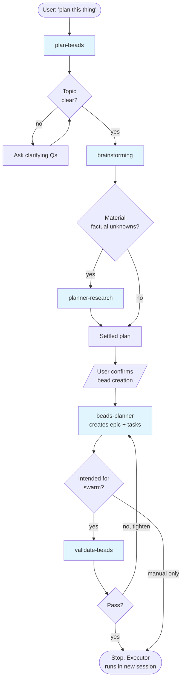
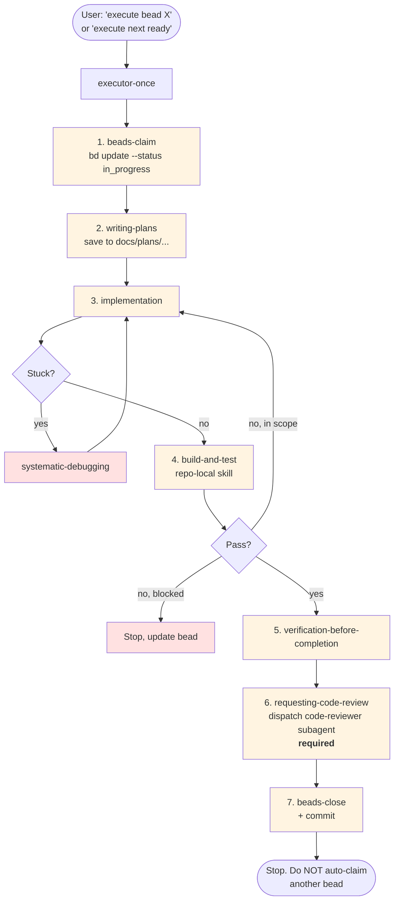
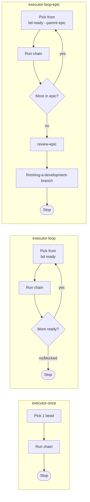
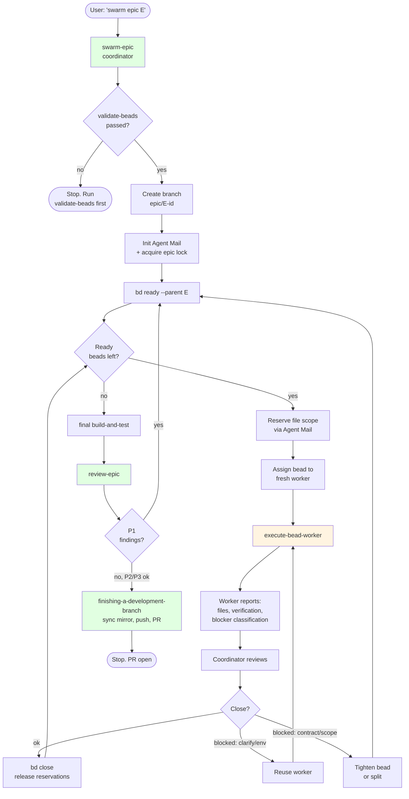
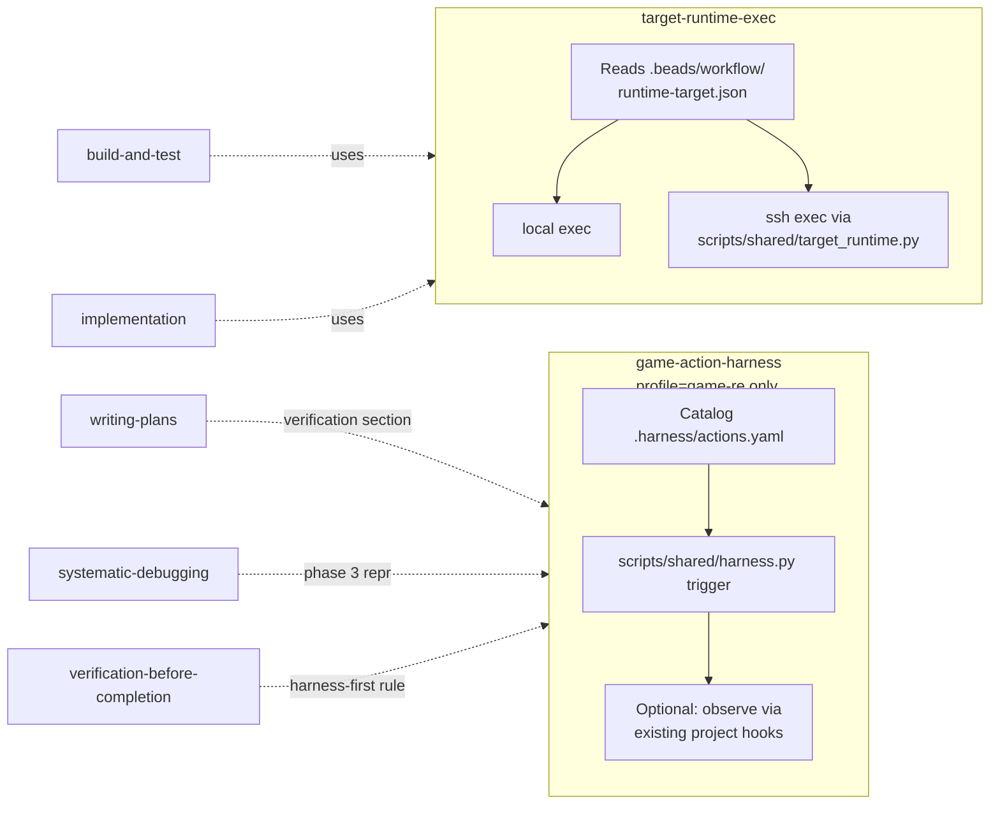

# Skills Relationships

A map of every skill under `skills/` — what each one does, who calls it, who it calls, and where it sits in the overall workflow. Read this before customizing or adding a skill so the new piece slots into an existing seam instead of creating a parallel one.

The canonical end-user description of the workflow lives in `templates/BEADS_WORKFLOW.md` (which is what gets shipped into downstream repos). This document is the _internal_ view: the skills as a graph.

---

## 1. The three execution modes

```mermaid
flowchart LR
    subgraph PLAN["🧠 Planner mode<br/>(no code, no claims)"]
        BS[brainstorming]
        PR[planner-research]
        BP[beads-planner]
        PB[plan-beads<br/>orchestrator]
        VB[validate-beads]
    end

    subgraph EXEC["🔨 Executor mode<br/>(one bead, one session)"]
        BC[beads-claim]
        WP[writing-plans]
        IMP[(implementation)]
        SD[systematic-debugging]
        VBC[verification-before-completion]
        RCR[requesting-code-review]
        BCL[beads-close]
        EO[executor-once<br/>orchestrator]
        ET[executor-task<br/>orchestrator<br/>PR-per-bead]
        EL[executor-loop<br/>orchestrator]
        ELE[executor-loop-epic<br/>orchestrator]
    end

    subgraph SWARM["🐝 Swarm mode<br/>(coordinator + fresh workers)"]
        SE[swarm-epic<br/>coordinator]
        EBW[execute-bead-worker]
        RE[review-epic]
        FDB[finishing-a-development-branch]
    end

    subgraph MAINT["🔧 Maintenance / out-of-band"]
        APC[address-pr-comments]
        PA[project-auditor]
        ABR[audit-backlog-rules]
        SWB[sync-workflow-backup]
        RWB[restore-workflow-backup]
    end

    subgraph CC["🧰 Cross-cutting helpers"]
        TRE[target-runtime-exec]
        GAH[game-action-harness<br/>profile=game-re only]
    end

    PLAN -->|hands off epic| EXEC
    PLAN -->|hands off epic| SWARM
    EXEC -->|epic complete| FDB
    SWARM -->|epic complete| RE --> FDB
    EXEC -.uses.-> CC
    SWARM -.uses.-> CC
```

Every skill belongs to exactly one of three modes. The mode boundary is what the `<HARD-GATE>` blocks in many SKILL.md files are protecting.

**Hard rule encoded in the diagram:** planner skills must NOT invoke executor or swarm skills. The bead-creation handoff is the _only_ legal exit from planner mode.

**Maintenance skills** are user-invoked at any point and don't belong to a phase: they sit alongside the workflow rather than inside it. They may dispatch internal subagents (see §6.5) but never claim, plan, or close beads.

---

## 2. Skill catalog (one-liner per skill)

| Skill                            | Mode                            | Role                                               | Invoked by                                                                | Invokes                                                                            |
| -------------------------------- | ------------------------------- | -------------------------------------------------- | ------------------------------------------------------------------------- | ---------------------------------------------------------------------------------- |
| `brainstorming`                  | planner                         | Turn fuzzy idea into a settled design              | `plan-beads`, user                                                        | `planner-research` (optional)                                                      |
| `planner-research`               | planner                         | Resolve factual unknowns before bead creation      | `brainstorming`, `plan-beads`                                             | —                                                                                  |
| `beads-planner`                  | planner                         | Translate settled plan into epic + tasks           | `plan-beads`                                                              | —                                                                                  |
| `plan-beads`                     | planner (orchestrator)          | Run a full planner session end-to-end              | user                                                                      | `brainstorming` → `planner-research` → `beads-planner` → `validate-beads`          |
| `validate-beads`                 | planner                         | Quality gate before swarm execution                | `plan-beads`, user                                                        | —                                                                                  |
| `beads-claim`                    | executor                        | Find + claim one ready bead                        | `executor-*` orchestrators, user                                          | —                                                                                  |
| `writing-plans`                  | executor                        | Write the implementation plan for the claimed bead | `executor-*` orchestrators, user                                          | `requesting-code-review` (for plan review during chunked drafting)                 |
| `systematic-debugging`           | executor                        | Root-cause investigation when blocked              | implementation step                                                       | `game-action-harness` (phase 3, if installed)                                      |
| `verification-before-completion` | executor                        | Evidence-before-claims gate                        | `executor-*` orchestrators                                                | `game-action-harness` (if installed)                                               |
| `requesting-code-review`         | executor                        | Dispatch the local code-reviewer subagent (`.claude/agents/code-reviewer.md` / `.codex/agents/code-reviewer.md`) | `executor-*` orchestrators (required, not optional)                       | —                                                                                  |
| `beads-close`                    | executor                        | Close bead + create follow-ups + commit            | `executor-*` orchestrators, user                                          | —                                                                                  |
| `executor-once`                  | executor (orchestrator)         | One bead, end-to-end, fresh context                | user                                                                      | `beads-claim` → `writing-plans` → impl → `build-and-test` → verify → `beads-close` |
| `executor-task`                  | executor (orchestrator)         | One bead delivered as its own PR off a fresh branch from main | user                                                                      | stash/branch off main → same chain as `executor-once` → push + open PR             |
| `executor-loop`                  | executor (orchestrator)         | Sequential beads from the global ready queue       | user                                                                      | same chain as `executor-once`, repeated                                            |
| `executor-loop-epic`             | executor (orchestrator)         | Sequential beads scoped to one epic                | user                                                                      | same chain + `review-epic` + `finishing-a-development-branch`                      |
| `swarm-epic`                     | swarm                           | Coordinate parallel workers under one epic         | user                                                                      | `execute-bead-worker` (per bead), `review-epic`, `finishing-a-development-branch`  |
| `execute-bead-worker`            | swarm                           | Implement one assigned bead; reports back          | `swarm-epic` only                                                         | —                                                                                  |
| `review-epic`                    | swarm                           | Epic-level quality gate after all beads close      | `swarm-epic`, `executor-loop-epic`                                        | —                                                                                  |
| `finishing-a-development-branch` | swarm/exec                      | Sync backup mirror, push, create PR                | `swarm-epic`, `executor-loop-epic`, user                                  | —                                                                                  |
| `address-pr-comments`            | maintenance                     | Iterative PR review-comment loop                   | user                                                                      | `pr-comment-fixer` subagent                                                        |
| `project-auditor`                | maintenance                     | Full-repo audit (naming, structure, light arch)    | user                                                                      | `project-auditor` subagent                                                         |
| `audit-backlog-rules`            | maintenance                     | Audit ready/blocked beads against current rules    | user                                                                      | —                                                                                  |
| `sync-workflow-backup`           | maintenance                     | Push managed workflow files into the backup mirror | user                                                                      | `scripts/{posix,windows}/sync-workflow-backup.{sh,ps1}`                            |
| `restore-workflow-backup`        | maintenance                     | Copy managed workflow files back from backup mirror | user                                                                      | `scripts/{posix,windows}/restore-workflow-backup.{sh,ps1}`                         |
| `target-runtime-exec`            | cross-cutting                   | Route build/test/run through local or SSH          | implementation steps, `build-and-test`                                    | —                                                                                  |
| `game-action-harness`            | cross-cutting (profile=game-re) | Trigger in-game actions for verification           | `writing-plans`, `systematic-debugging`, `verification-before-completion` | —                                                                                  |

> Note: `build-and-test` is **not** in `skills/` — it lives under `templates/.codex/skills/build-and-test/` and `templates/.claude/skills/build-and-test/` because it is the one skill the downstream repo specializes (stage 2). Treat it as the implicit verification step in every executor chain.

---

## 3. Planner session flow (`plan-beads` orchestration)

**Key invariant:** the planner session ends at `DONE`. It does NOT invoke `beads-claim`, `writing-plans`, or any implementation skill. The user starts executor work in a _separate_ session.

---

## 4. Single-bead executor flow (`executor-once`)

This is the canonical 8-step chain. `executor-loop` and `executor-loop-epic` are just this chain repeated, with different ready-bead selection rules.

**`executor-loop` vs `executor-loop-epic` vs `executor-once`:**

All three are **compatibility paths**. The SKILL.md files explicitly call out that `swarm-epic` is preferred for epic-scoped work, and fresh `executor-once` sessions are preferred over long loops that accumulate context.

---

## 5. Swarm flow (`swarm-epic` + workers)

This is the primary path for epic execution. The coordinator stays thin; workers are spawned fresh per bead.

**Worker hard rules** (encoded in `execute-bead-worker`):

- Workers never run `bd update` or `bd close` — only the coordinator mutates bead state.
- Workers receive the full persisted contract (`Read:` / `Inputs:` / `Files:` / `Verify:` / `Risk:` / `Parallel:` / `Escalate:`) — they don't replay coordinator chat.
- Workers reserve their `Files:` scope via Agent Mail before editing.
- A blocked worker classifies the blocker as one of `clarify` / `env` / `contract` / `scope` so the coordinator can decide whether to reuse the worker or replace it.

---

## 6. Cross-cutting helpers

These are not phase skills; they're called _from inside_ phase skills.

**Key seams to know about:**

- `target-runtime-exec` is the _only_ place runtime-routing logic lives. Anything that builds, tests, runs, deploys, or migrates should funnel through it. Reading files / git inspection should NOT.
- `game-action-harness` is profile-gated. It's only present in repos bootstrapped with `profile=game-re`. The "harness-first rule" appears in `writing-plans`, `systematic-debugging`, and `verification-before-completion` to enforce that the agent triggers actions itself instead of asking the user to play the game.

---

## 6.5. Agents (subagents)

Agents live in `agents/` (shared, copied to both `.claude/agents/` and `.codex/agents/` downstream — see `scaffold-repo-files.sh:151`). They are dispatched as fresh, sandboxed sessions that don't see the caller's chat history; the caller passes a self-contained brief.

| Agent                  | Caller                                                                | Role                                                                                  |
| ---------------------- | --------------------------------------------------------------------- | ------------------------------------------------------------------------------------- |
| `code-reviewer`        | `requesting-code-review` skill (executor chain)                       | Per-diff review against project standards (skill-internal)                            |
| `pr-comment-fixer`     | `address-pr-comments` skill                                           | Read unresolved PR threads, edit code, return reply plan (skill-internal)             |
| `project-auditor`      | `project-auditor` skill                                               | Whole-repo audit + light architectural pass (skill-internal)                          |
| `product-manager`      | user                                                                  | Acceptance criteria + "done" checklist for a feature                                  |
| `engineering-manager`  | user (typically after `product-manager`)                              | Critical pass over the PM's spec — feasibility, scope creep, hidden cost              |
| `solution-design`      | user (after acceptance criteria are pinned)                           | High-level solution design: components, contracts, data flow, alternatives            |
| `backend-architect`    | user (plan or diff touching APIs/services/persistence)                | Opinionated backend review of a plan or diff                                          |
| `frontend-architect`   | user (plan or diff touching UI/components/styling)                    | Opinionated frontend review of a plan or diff                                         |
| `testing-strategist`   | user (after a plan is settled)                                        | Enumerate tests required to ship with confidence                                      |
| `junior-engineer`      | user (before starting under-specified work)                           | Numbered list of clarifying questions; never writes code                              |

**Hard rule:** only `code-reviewer`, `pr-comment-fixer`, and `project-auditor` are skill-internal. The rest are direct user invocations — skills must not dispatch them. If a skill needs planner-style review, it goes through the planner skills, not these agents.

**Provider overrides:** if a downstream needs to diverge per provider, drop the override in `templates/.claude/agents/<name>.md` or `templates/.codex/agents/<name>.md`. Scaffold copies shared `agents/` first, then overlays the provider-specific dir (`scaffold-repo-files.sh:162-174`).

---

## 7. Full invocation graph

The complete picture — every legal "skill X invokes skill Y" edge in one diagram. Solid lines = orchestration; dashed lines = optional/conditional invocation.

```mermaid
flowchart TD
    USER([user])

    USER --> PB[plan-beads]
    USER --> EO[executor-once]
    USER --> ET[executor-task]
    USER --> EL[executor-loop]
    USER --> ELE[executor-loop-epic]
    USER --> SE[swarm-epic]
    USER --> VB[validate-beads]
    USER --> BC[beads-claim]
    USER --> BCL[beads-close]
    USER --> FDB[finishing-a-development-branch]
    USER --> APC[address-pr-comments]
    USER --> PA[project-auditor]
    USER --> ABR[audit-backlog-rules]
    USER --> SWB[sync-workflow-backup]
    USER --> RWB[restore-workflow-backup]

    PB --> BS[brainstorming]
    PB -.-> PR[planner-research]
    PB --> BP[beads-planner]
    PB --> VB
    BS -.-> PR

    EO --> BC
    EO --> WP[writing-plans]
    EO -.-> SD[systematic-debugging]
    EO --> BAT[build-and-test]
    EO --> VBC[verification-before-completion]
    EO --> RCR[requesting-code-review]
    EO --> BCL

    ET --> BC
    ET --> WP
    ET -.-> SD
    ET --> BAT
    ET --> VBC
    ET --> RCR
    ET --> BCL

    EL --> BC
    EL --> WP
    EL -.-> SD
    EL --> BAT
    EL --> VBC
    EL --> RCR
    EL --> BCL

    ELE --> BC
    ELE --> WP
    ELE -.-> SD
    ELE --> BAT
    ELE --> VBC
    ELE --> RCR
    ELE --> BCL
    ELE --> RE[review-epic]
    ELE --> FDB

    SE --> EBW[execute-bead-worker]
    SE --> BAT
    SE --> RE
    SE --> FDB

    EBW --> BAT
    EBW -.-> SD

    SD -.-> GAH[game-action-harness]
    VBC -.-> GAH
    WP -.-> GAH

    BAT -.-> TRE[target-runtime-exec]
    EBW -.-> TRE

    RCR --> AGCR([agent: code-reviewer])
    APC --> AGPF([agent: pr-comment-fixer])
    PA --> AGPA([agent: project-auditor])

    classDef planner fill:#e1f5ff,stroke:#0277bd
    classDef executor fill:#fff4e1,stroke:#ef6c00
    classDef swarm fill:#e1ffe1,stroke:#2e7d32
    classDef cross fill:#f3e1ff,stroke:#6a1b9a
    classDef maint fill:#ffe1f0,stroke:#ad1457
    classDef agent fill:#fffde1,stroke:#9e9d24

    class PB,BS,PR,BP,VB planner
    class EO,ET,EL,ELE,BC,WP,SD,BAT,VBC,RCR,BCL executor
    class SE,EBW,RE,FDB swarm
    class TRE,GAH cross
    class APC,PA,ABR,SWB,RWB maint
    class AGCR,AGPF,AGPA agent
```

---

## 8. Customizing or adding a skill

When you add or rename a skill, four places need to stay consistent:

1. **The SKILL.md** — frontmatter `name` + `description`, `<HARD-GATE>` if it must not run in the wrong mode, and explicit "invoked by / invokes" links to other skills.
2. **`scripts/posix/scaffold-repo-files.sh` and `scripts/windows/scaffold-repo-files.ps1`** — these are the authority on what gets copied into downstream `.codex/skills/` and `.claude/skills/`. New skill ⇒ add the copy line. Removed skill ⇒ add a `rm -rf` / `Remove-Item` line so existing downstreams clean up on next `update-skills`.
3. **Profile gating** — if the skill is profile-specific (like `game-action-harness`), add it to `profile_gated_skills` in both scaffold scripts. Don't gate ad hoc.
4. **`templates/AGENTS.snippet.md` and `templates/CLAUDE.snippet.md`** — if the skill should appear in the managed instructions block downstream, mention it there. The block lives between `<!-- BEGIN/END TEMPLATE BD WORKFLOW -->` markers — never remove or rename those markers.

**Adding an agent** is a parallel surface: drop the file in `agents/<name>.md` and scaffold copies it to both providers automatically (`scaffold-repo-files.sh:151-159`). Provider-specific overrides go in `templates/.codex/agents/` or `templates/.claude/agents/`. When _removing_ an agent, add the explicit `rm -rf` / `Remove-Item` lines for both `.codex/agents/<name>.md` and `.claude/agents/<name>.md` in both scaffold scripts so existing downstreams clean up.

**Where to slot a new skill — quick decisions:**

| If your new skill is…                                         | Add it as a peer of…                           | Make sure it…                                                                                                        |
| ------------------------------------------------------------- | ---------------------------------------------- | -------------------------------------------------------------------------------------------------------------------- |
| A new planning step (e.g., risk assessment, security review)  | `planner-research`                             | Has a planner `<HARD-GATE>`; only invocable from `plan-beads` or directly by the user                                |
| A new executor step (e.g., perf benchmark, contract test)     | `verification-before-completion`               | Plugs into the 8-step chain in `executor-once` / `executor-loop` / `executor-loop-epic` — update those orchestrators |
| A new orchestrator (different bead-selection strategy)        | `executor-loop`                                | Composes the same 8-step chain; doesn't reinvent claim/close logic                                                   |
| A new cross-cutting helper (new runtime, new external system) | `target-runtime-exec` or `game-action-harness` | Is invoked _from inside_ phase skills, doesn't introduce a new mode                                                  |
| A new swarm role (e.g., reviewer worker)                      | `execute-bead-worker`                          | Coordinator (`swarm-epic`) is the only writer of bead state; workers report back                                     |
| A new maintenance op (audit, backup, PR helper)               | `audit-backlog-rules` or `address-pr-comments` | User-invoked only; never claims/closes beads; if it dispatches an agent, the agent gets a self-contained brief       |
| A new subagent (planner-style review, audit, fixer)           | `agents/<name>.md`                             | Decide if it's user-invocable (default) or skill-internal; only a skill can dispatch a skill-internal one            |

**Anti-patterns to avoid** (these are repeatedly enforced in the existing SKILL.md `<HARD-GATE>` blocks):

- A planner skill that claims a bead or writes code.
- An executor skill that re-plans the epic or creates new top-level beads outside the active one.
- A worker skill that mutates `bd` state directly instead of reporting to the coordinator.
- A skill that invokes `build-and-test` without going through `target-runtime-exec` for runtime-dependent commands.
- A second source of truth for task state (parallel TODO trackers, planning JSONs alongside Beads).

---

## 9. Reading order for newcomers

If you're trying to learn the system from scratch, read the SKILL.md files in this order:

1. `plan-beads` — understand the planner session shape
2. `brainstorming` — the heart of planner mode
3. `beads-planner` + `validate-beads` — how a plan becomes Beads
4. `executor-once` — the canonical executor chain
5. `writing-plans` — the executor's most opinionated step
6. `verification-before-completion` — why "tests pass" requires evidence
7. `swarm-epic` + `execute-bead-worker` — the multi-agent path
8. `target-runtime-exec` — runtime routing seam
9. `game-action-harness` (only if working with `profile=game-re`)

Then re-read this document. The graph should make more sense.
